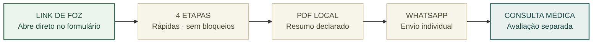
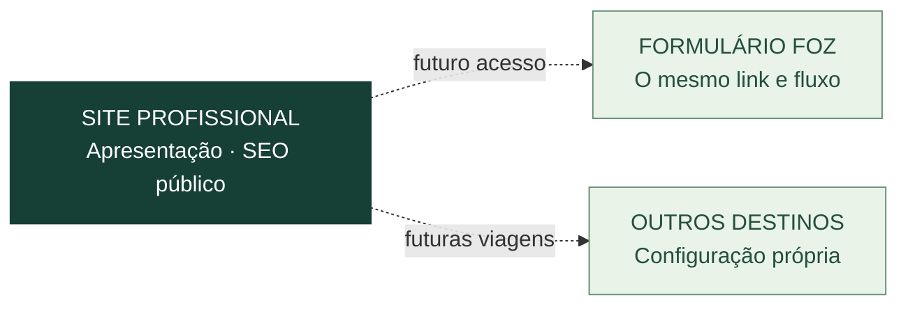

# Saúde pré-viagem

**FOZ DO IGUAÇU · FORMULÁRIO MÉDICO**

[**ABRIR FORMULÁRIO**](https://joyceradis.github.io/saude-viagem-foz/) · [**MAPA E ARQUITETURA**](docs/MAPA_DO_SITE_E_EVOLUCAO.md) · [**ROADMAP #2**](https://github.com/joyceradis/saude-viagem-foz/issues/2)

> [!CAUTION]
> **PRODUÇÃO CONGELADA · v5.0.0**  
> **Não alterar o formulário publicado até nova autorização expressa da médica.** Preservar integralmente HTML, CSS, JavaScript, PDF, etapas, imagem, comportamento e URL. Sem redesign, CEP, redirecionamento ou publicação de protótipos no fluxo das pacientes.

## O que funciona hoje

O PDF **não é atestado**; a eventual documentação médica depende de avaliação individual. O código é público, mas **dados de saúde e PDFs preenchidos nunca devem entrar no repositório**.

## Depois, sem substituir o que já funciona

**Princípio:** Foz é um **formulário estático de entrada imediata**, não uma landing page. O site profissional será outra camada, ainda não integrada. SEO pertence às páginas institucionais; **formulários de saúde continuam `noindex`**.

**Histórico de decisão:** as propostas visuais [v6 / PR #1](https://github.com/joyceradis/saude-viagem-foz/pull/1) e [V2](https://github.com/joyceradis/saude-viagem-foz/issues/2) **foram rejeitadas**. O escopo futuro está na [issue #2](https://github.com/joyceradis/saude-viagem-foz/issues/2).

Atendimento médico individual e independente · Dra. Joyce Radis de Souza de Oliveira · CRM-ES 21188 · [Créditos e licenças](assets/CREDITS.md).
