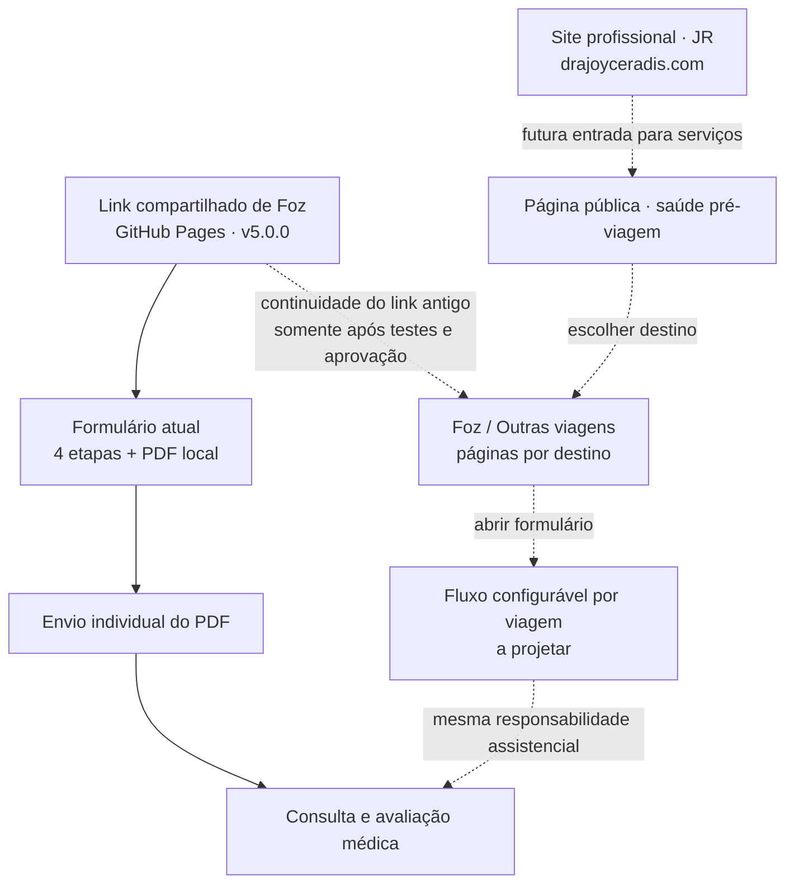

# Mapa do site · Saúde pré-viagem

**Documento de arquitetura e navegação.** Descreve o produto existente e uma direção futura; **não** representa rotas novas publicadas.

> **Estado:** produção de Foz preservada em [v5.0.0](https://github.com/joyceradis/saude-viagem-foz/releases/tag/v5.0.0) · [Formulário ativo](https://joyceradis.github.io/saude-viagem-foz/) · [Roadmap e decisões: issue #2](https://github.com/joyceradis/saude-viagem-foz/issues/2).

## 1. O que existe hoje

| Superfície | Endereço | Origem | Estado |
| --- | --- | --- | --- |
| Formulário Foz | https://joyceradis.github.io/saude-viagem-foz/ | `index.html` + `assets/` deste repositório | **Em uso · preservar** |
| PDF declaratório | Gerado no navegador da participante | `assets/app.js` + jsPDF local | **Em uso · não é atestado** |
| Site profissional | https://drajoyceradis.com/ | [Repositório JR](https://github.com/joyceradis/JR) | **Produto independente; integração futura não implantada** |

O formulário atual possui quatro etapas (dados pessoais, histórico de saúde, condição atual, revisão), gera PDF localmente e orienta envio individual pelo WhatsApp. A avaliação e a eventual emissão de documento médico ocorrem **separadamente**, por decisão profissional. O formulário está marcado com `noindex, nofollow`.

## 2. Mapa visual · existente versus futuro

**Linhas contínuas:** fluxo atual. **Linhas pontilhadas:** possibilidades futuras, sem URLs ou integrações implementadas.

## 3. Arquitetura-alvo · exemplos de rotas, NÃO publicadas

| Página planejada | Rota conceitual | Indexação |
| --- | --- | --- |
| Site profissional | `https://drajoyceradis.com/` | Página pública, observadas as regras de publicidade médica |
| Apresentação do serviço | `/servicos/saude-pre-viagem/` | **SEO público**, texto informativo e institucional |
| Informação por destino/viagem | `/viagens/<destino>/` | Pública somente quando houver conteúdo útil e autorizado |
| Questionário individual | `/viagens/<destino>/avaliacao/` | **`noindex`**; proteção e minimização de dados |
| URL legada de Foz | `joyceradis.github.io/saude-viagem-foz/` | Continuar operante; eventual redirecionamento futuro exige teste |

As rotas com `<destino>` são **exemplos**, não endereços que a participante já possa acessar.

## 4. Conteúdo variável por viagem, experiência constante

**Separar sem duplicar:** a futura configuração por excursão pode reunir `id`, destino, fotografia licenciada, período, legenda, orientações específicas, vínculo de divulgação e versão. O **núcleo do formulário** permanece reutilizável (histórico, perguntas clínicas revisadas, revisão e exportação), com controles de versão e testes.

- **Identidade emocional por destino:** a foto de Foz é protagonista no caso atual. Novas viagens podem ter sua própria fotografia e atmosfera, sem transformar a consulta em um formulário genérico.
- **Rapidez no celular:** passos curtos, escrita compreensível, continuidade sem bloqueio por formatação e correção posterior de campos incompletos. A ausência de informação **não equivale** a resposta negativa ou avaliação concluída.
- **Conclusão assistencial:** PDF declaratório → envio pela participante → contato/consulta → eventual documento conforme avaliação. Não prometer liberação ou atestado automático.
- **Preservar código e estabilidade:** implementação e regras clínicas pertencem a este repositório enquanto o serviço permanecer independente. O site JR pode oferecer uma entrada/rota, sem copiar lógica nem prontuários.

## 5. SEO certo, no lugar certo

**Páginas públicas institucionais e de informação:** título e descrição exclusivos; texto acessível e útil; URL sem ambiguidade; metadados Open Graph; `canonical`; desempenho, acessibilidade e mobile; dados estruturados pertinentes e verdadeiros; `robots.txt` e `sitemap.xml` **somente para as rotas públicas aprovadas**. Verificar eventuais diretrizes do CFM para comunicação médica.

**Formulário clínico:** `noindex`, sem dados de pacientes em HTML/URL, sem indexação de PDFs preenchidos e sem expor dados pessoais a analytics. `noindex` não substitui segurança, autorização ou sigilo. Não incluir questionários em `sitemap.xml`.

**Migração futura:** verificar links antigos enviados por WhatsApp, domínio, HTTPS, redirecionamento (incluindo comportamento em iPhone), métricas técnicas sem dados de saúde e plano de reversão antes de qualquer mudança de URL.

## 6. Direção visual · inspiração, não cópia

[Pasta Pinterest da autora](https://pin.it/f1wFJlAxY) · referências de sites de naturezas diferentes.

A captura compartilhada ilustra linguagens distintas: editorial botânico em verdes e terrosos, grandes composições fotográficas, máscaras/formas orgânicas, telas de login e dashboards. **Para o produto pré-viagem**, priorizar:

- fotografia marcante do destino e hierarquia editorial com espaço em branco;
- paleta natural sofisticada e componentes discretos, preservando legibilidade;
- jornada mobile curta, sem adicionar etapas ou adornos que prejudiquem conversão;
- revisão visual baseada em protótipos e aprovação da autora **antes** de alterar produção.

**Não importar dashboards, layouts de login ou elementos de outras referências** para o questionário só porque fazem parte da mesma pasta; e não usar imagens alheias sem licença/autorização.

## 7. Controle da evolução

**Fonte canônica do produto:** [README da aplicação](../README.md) → **este mapa** para a navegação e limites → [issue #2](https://github.com/joyceradis/saude-viagem-foz/issues/2) para o backlog e critérios de aceite.

A prévia v6 do [PR #1](https://github.com/joyceradis/saude-viagem-foz/pull/1) não foi aprovada visualmente: é uma experiência histórica, **não uma implementação a ser publicada**. Qualquer evolução deve partir da versão aprovada, preservar o link ativo e passar por testes em ambiente isolado. Não há requisito atual de login ou de integração com outros sistemas.
