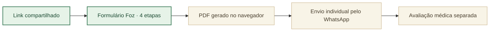
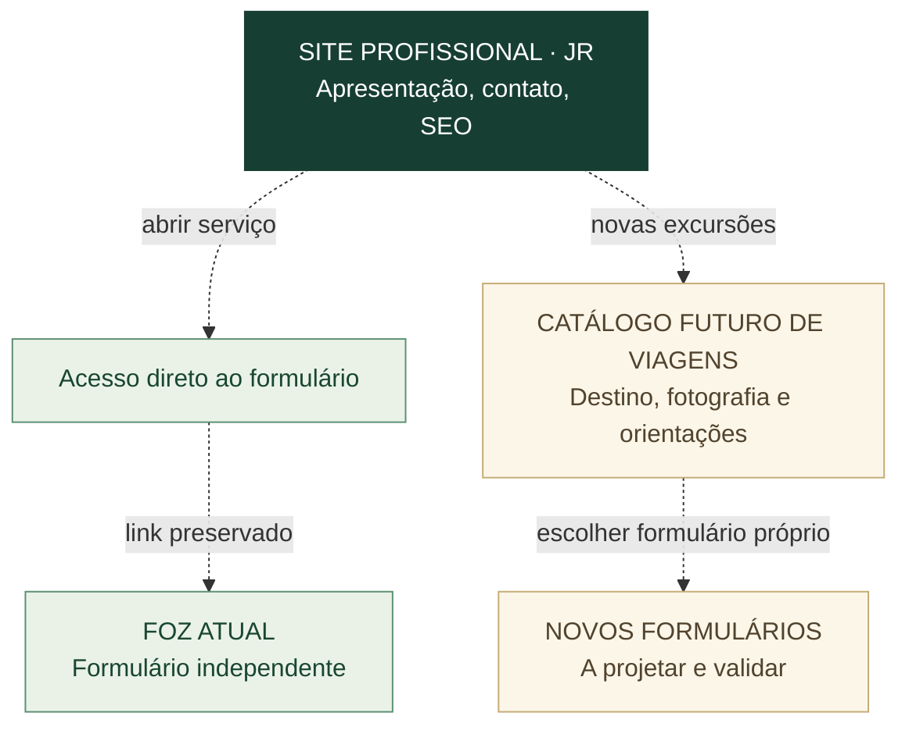

# Mapa do produto · formulário Foz e integração futura

**Referência:** [README](../README.md) · [Formulário publicado](https://joyceradis.github.io/saude-viagem-foz/) · [Issue #2 (decisões e evolução)](https://github.com/joyceradis/saude-viagem-foz/issues/2).

> **Decisão da autora, 10/10/2026:** Foz é um formulário estático e imediato. O redesign V2 (landing editorial) e o protótipo v6 (CEP + cartão final) foram **rejeitados**. **Até nova autorização expressa, não alterar a página publicada, suas funções ou o endereço compartilhado.**

## 1 · Produto atual (única experiência aprovada)

| Parte | Código | Responsabilidade |
| --- | --- | --- |
| Abertura e quatro etapas | [`index.html`](../index.html) | Entrar e preencher, sem landing intermediária |
| Estilo e imagem do destino | [`assets/styles.css`](../assets/styles.css) · `assets/iguacu.jpg` | Reconhecimento imediato, visual claro no celular |
| Revisão e PDF | [`assets/app.js`](../assets/app.js) · `assets/vendor/jspdf.umd.min.js` | Resumo declaratório local; não é atestado |
| Atendimento | Fora do site | Envio do PDF e consulta individual, com conduta médica própria |

O código HTML/CSS/JS da produção permanece com os **mesmos blobs da release [v5.0.0](https://github.com/joyceradis/saude-viagem-foz/releases/tag/v5.0.0)**. As pacientes já utilizam esse endereço. **Sem testes ou publicação de propostas rejeitadas no fluxo atual.**

## 2 · Projeto futuro: apresentar o serviço dentro do site profissional

- **Não converter Foz em SPA, landing, catálogo ou dashboard.** A página atual começa no formulário.
- **Contêiner futuro:** [repositório JR](https://github.com/joyceradis/JR), vinculado ao site `drajoyceradis.com` **atualmente com indisponibilidade relatada** ([issue de recuperação](https://github.com/joyceradis/JR/issues/1)). Ele poderá oferecer uma entrada para o formulário, inicialmente por **link direto**; incorporação na mesma interface só após análise de UX, compatibilidade e privacidade.
- **Novas viagens:** reutilizar componentes quando apropriado e separar configuração do destino (nome, imagem licenciada, datas, orientações) das regras clínicas. **Não afirmar que já existe motor multi-viagens.**
- **Migração de URLs:** nunca quebrar o endereço Foz distribuído por WhatsApp. Propor redirecionamento somente depois de comprovar rota substituta, comportamento em iPhone e possibilidade de retorno; não é tarefa atual.
- **SEO:** metadados, conteúdo institucional, `canonical`, Open Graph e sitemap só nas páginas públicas apropriadas do site profissional. Questionários e informações de saúde permanecem fora da indexação; `noindex` não substitui controle de acesso.
- **Visual:** a pasta de [inspirações Pinterest](https://pin.it/f1wFJlAxY) inclui sites institucionais, interfaces de login e dashboards. **Essas referências são da plataforma futura, não instrução para redesenhar Foz.**

## 3 · Rastreabilidade e aprovação

| Registro | Estado |
| --- | --- |
| [Foz v5.0.0](https://github.com/joyceradis/saude-viagem-foz/releases/tag/v5.0.0) | **Única versão clínica em uso** |
| [PR #1: v6/CEP](https://github.com/joyceradis/saude-viagem-foz/pull/1) | **Rejeitado e fechado, sem merge** |
| [Protótipo V2](https://joyceradis.github.io/saude-viagem-foz/previews/v2/) | **Rejeitado, histórico; não distribuir a pacientes** |
| [Issue #2](https://github.com/joyceradis/saude-viagem-foz/issues/2) | **Backlog futuro, não autoriza implementação em produção** |
| [JR · issue #1](https://github.com/joyceradis/JR/issues/1) | **Recuperação do site profissional, trabalho separado** |

**Regra operacional:** propostas reversíveis, protótipos e investigações podem ocorrer fora da produção. **Nenhuma alteração, integração, implantação, redirecionamento ou substituição do formulário Foz sem autorização expressa posterior da autora.** Documentação não é autorização para modificar produção.
